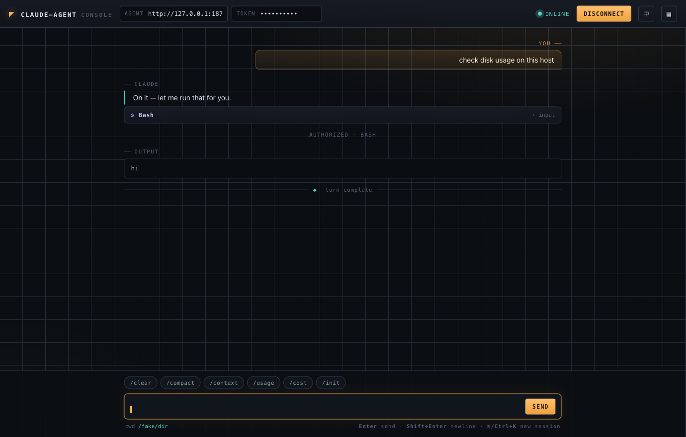
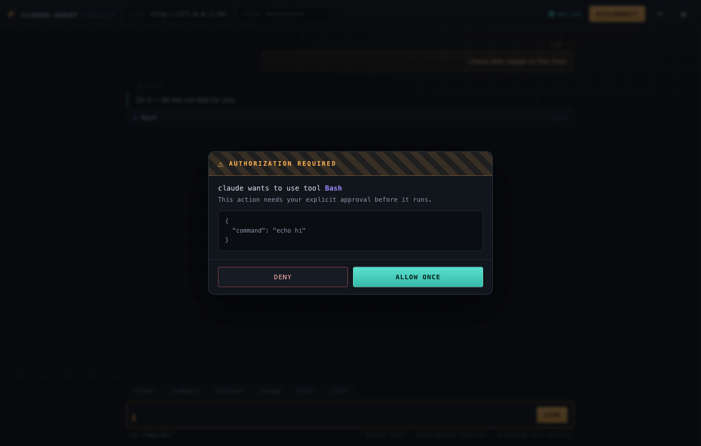
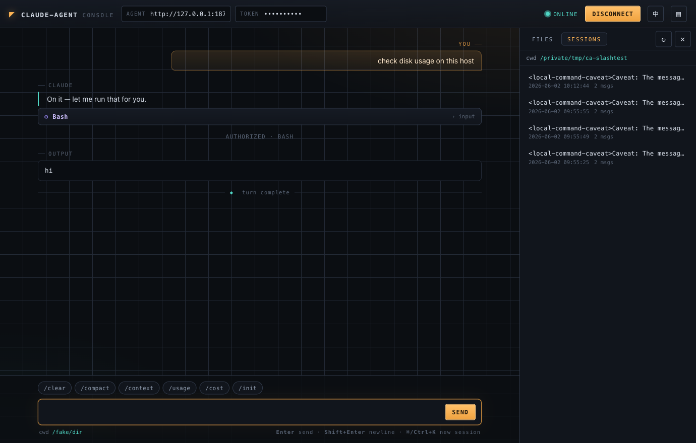

# claude-agent

[简体中文](./README.md) · **English**

> A tiny, single-binary agent that lets you drive [Claude Code](https://docs.anthropic.com/en/docs/claude-code) on a **remote machine** from your browser — over WebSocket, with **human-in-the-loop approval** for every dangerous action.

`claude-agent` runs on a target server, spawns the locally-installed `claude` CLI as a
subprocess (speaking its `stream-json` bidirectional control protocol), and exposes a
token-authenticated WebSocket endpoint. It ships with a **zero-dependency web console**
embedded in the binary, so you can point a browser at it and start working immediately.

```
  Browser ──WS──> claude-agent (target host) ──subprocess──> claude code CLI
   web console        token auth                              runs on the box itself
```

No API keys live in the agent. Credentials, model selection, and any third-party gateway
config are entirely owned by the `claude` CLI on the target machine — the agent just drives it.


<p align="center"><em>The built-in console — chat, native command bar, tool cards, and human-in-the-loop approval.</em></p>

---

## Why

Sometimes the box you need Claude Code to work on isn't the box in front of you: a
production server, a build host, a VM behind a bastion. `claude-agent` gives that box a
thin, auditable remote-control surface:

- **Single static binary**, zero runtime dependencies — drop it on the host and run.
- **Embedded web console** — no separate frontend to build or host.
- **Permission prompts surface in your browser.** The agent runs `claude` with
  `--permission-mode default`, so every privileged tool call (Bash, file writes, …) is
  forwarded to you as a `permission_request` and only executes after you click **Allow**.
- **Fenced file manager** — browse / view / download / upload within the working
  directory, with strict path-jail (no `..` escape, no symlink escape).
- **Embeddable** — the same WebSocket endpoint can sit behind your own auth-relay backend
  if you'd rather not expose the agent directly.

---

## Quick start

### 1. Prerequisites

On the **target machine**:

- The `claude` CLI is installed and **works when run manually by the same user** that will
  run the agent (i.e. `claude` can already authenticate and hold a conversation). The agent
  inherits whatever credentials/config that user's `claude` already has.
- Go 1.25+ (only if you build from source).

### 2. Build & run

```bash
git clone https://github.com/Mrliuch/claude-agent.git
cd claude-agent
go build -o claude-agent .

# pick a long random shared token
AGENT_TOKEN=$(openssl rand -hex 24) ./claude-agent
```

Then open `http://<host>:8765/` in a browser, paste the same token, and hit **Connect**.

> The web console is served at `/` from the same origin, so there are no CORS hoops. The
> token you paste in the browser is **not** baked into the served HTML.

---

## Configuration

All configuration is via environment variables.

| Variable | Description | Default |
|----------|-------------|---------|
| `AGENT_TOKEN` | **Required.** Shared auth token; clients must present it. | — |
| `AGENT_LISTEN_ADDR` | Listen address. | `:8765` |
| `AGENT_UI` | Set to `off` to disable the built-in web console at `/`. | `on` |
| `CLAUDE_BIN` | Path/command for the Claude Code CLI. | `claude` |
| `CLAUDE_MODEL` | Model to pass to `claude`; empty = CLI default. | _(empty)_ |
| `CLAUDE_WORK_DIR` | Working directory for `claude` (and the file-manager jail root). Empty = the run user's `$HOME`. | _(empty)_ |
| `CLAUDE_PERMISSION_MODE` | Passed to `claude --permission-mode`. Keep `default` so dangerous ops prompt. | `default` |
| `CLAUDE_IDLE_TIMEOUT` | Seconds of inactivity before the session (and the `claude` child process) is reaped. `0` = disabled. | `1800` |
| `AGENT_DEBUG` | Set to any value to log raw bridge traffic. | _(empty)_ |

> ⚠️ **Never** set `CLAUDE_PERMISSION_MODE` to anything that bypasses prompts on a host you
> care about. The whole point is that *you* approve each action.

---

## Deployment

### Option A — Run the binary directly (recommended)

Running on the host directly means `claude` can see the **real host filesystem** — best for
actually troubleshooting that machine.

`/etc/systemd/system/claude-agent.service`:

```ini
[Unit]
Description=claude-agent
After=network.target

[Service]
User=ops
Environment=AGENT_TOKEN=<your-random-token>
Environment=AGENT_LISTEN_ADDR=:8765
Environment=CLAUDE_WORK_DIR=/home/ops
ExecStart=/usr/local/bin/claude-agent
Restart=always

[Install]
WantedBy=multi-user.target
```

```bash
sudo systemctl daemon-reload && sudo systemctl enable --now claude-agent
```

### Option B — Docker

The provided `Dockerfile` builds the agent and bundles Node + the Claude Code CLI.

```bash
docker build -t claude-agent .
docker run -d --name claude-agent -p 8765:8765 \
  -e AGENT_TOKEN=<your-random-token> \
  claude-agent
```

> ⚠️ Inside a container, `claude` only sees the **container's** filesystem. To work on the
> host, prefer Option A, or mount host paths / use `--network host` and grant access
> deliberately.

---

## Security model

`claude-agent` gives a browser the ability to run commands on a machine. Treat the token
like a production credential and lock the surface down:

- **Firewall the port.** Only allow the networks/hosts that should reach it.
- **The token rides in the query string** (WebSocket can't carry custom headers easily).
  Put TLS in front for anything beyond a trusted LAN/VPN — terminate `wss://` at a reverse
  proxy, or tunnel over SSH/VPN.
- **Approval is mandatory by design.** With `--permission-mode default`, no privileged tool
  runs until you allow it in the browser. Deny is always one click away (or `Esc`).
- **The file manager is path-jailed** to `CLAUDE_WORK_DIR`: lexical `..` is neutralized and
  symlinks are resolved and re-checked against the jail root before any read/write.
- **Disable the console** with `AGENT_UI=off` if you only want to drive the agent from your
  own backend relay.

---

## Web console

Served at `/` (unless `AGENT_UI=off`). It's a single self-contained HTML file embedded in
the binary — no build step, no external fonts or CDNs, works offline.

- **Chat** with the remote Claude: streamed assistant text, tool-use cards, and tool output.
- **Native command bar** — one click sends `/clear`, `/compact`, `/context`, `/usage`,
  `/cost`, or `/init` straight to Claude (these run over the same `stream-json` channel).
- **Authorization overlay** for every `permission_request` — see the exact tool + input
  before allowing/denying.
- **Files drawer** — browse the working directory, view text files, download, all jailed.
- **History sessions** — see the current directory's past Claude sessions, read any
  transcript, and **resume** one to continue with full context (`--resume`).
- **Session continuity** — the console remembers the `session_id` and reconnects with
  `--resume`; `⌘/Ctrl+K` starts a fresh session.
- **Bilingual UI** — one-click English ⇄ 中文 toggle in the top-right (remembers your choice).

Every dangerous action stops for your approval:



Browse and resume the working directory's Claude history:



---

## Using it behind your own backend (relay mode)

The WebSocket endpoint is transport-agnostic: any backend can authenticate its own users
however it likes, then **transparently relay frames** to `claude-agent`. The agent stays a
dumb, token-gated executor; your backend never needs an API key. Set `AGENT_UI=off` and the
agent becomes purely a protocol endpoint.

---

## Protocol reference

WebSocket: `GET /agent/chat?token=<AGENT_TOKEN>[&session_id=<id>]`
Health check: `GET /healthz` → `{"status":"ok"}`

**Client → server**

```jsonc
{ "type": "user_message", "text": "check disk usage" }
{ "type": "user_message", "text": "/context" }   // native slash commands work too
{ "type": "permission_response", "request_id": "...", "allow": true, "tool_input": { } }
{ "type": "close" }
```

> Native Claude slash commands (`/clear`, `/compact`, `/context`, `/usage`, `/cost`,
> `/init`, …) are just user messages whose text starts with `/` — Claude interprets them
> over the same `stream-json` channel, so the console's command bar simply sends them.

**Server → client**

| `type` | Meaning |
|--------|---------|
| `ready` | Session is up. Carries `cwd`, `session_id`. |
| `assistant` | `blocks[]` of `{kind:"text"}` / `{kind:"tool_use", name, input}`. |
| `tool_result` | `results[]` of `{content, is_error}`. |
| `permission_request` | `request_id`, `tool_name`, `tool_input`, `title`, `description`. |
| `result` | Turn summary: `subtype`, `is_error`, `duration_ms`, `total_cost_usd`, `result`. |
| `error` | `{msg}`. |
| `closed` | `claude` exited; `stderr` tail included. |

### File-manager HTTP API

All require `?token=<AGENT_TOKEN>`; all paths are relative to and jailed within
`CLAUDE_WORK_DIR`. Responses use the envelope `{code, msg, data}` (`code:0` = ok).

| Method & path | Purpose |
|---------------|---------|
| `GET  /agent/fs/list?path=` | List a directory. |
| `GET  /agent/fs/read?path=` | Read a text file (≤1 MB, truncates). |
| `GET  /agent/fs/tree` | Recursive relative paths (skips `.git`, `node_modules`, …). |
| `GET  /agent/fs/download?path=` | Stream any file. |
| `POST /agent/fs/write` | `{path, content}`. |
| `POST /agent/fs/upload` | `{path, content_b64}` (≤50 MB). |
| `POST /agent/fs/mkdir` | `{path}`. |
| `DELETE /agent/fs/delete?path=` | Remove (cannot delete the jail root). |

### Session-history HTTP API

Read-only access to the **current working directory's** Claude session history (stored by
the CLI under `~/.claude/projects/<slug>/<id>.jsonl`). Token-gated; same `{code, msg, data}`
envelope.

| Method & path | Purpose |
|---------------|---------|
| `GET /agent/sessions/list` | List this directory's sessions (`id`, `title`, `messages`, `mtime`, `size`) plus its `cwd`. |
| `GET /agent/sessions/read?id=<uuid>` | Parse a session into a read-only transcript (`items[]` of `{role, blocks, ts}`). |

To **resume** a session, just open a chat WebSocket with `&session_id=<id>` — Claude
reattaches with `--resume` and the prior context.

---

## Development

```bash
go vet ./...
go test ./...     # includes an end-to-end test against a fake claude (zero API cost)
go build -o claude-agent .
```

The test suite uses `cmd/fakeclaude`, a stub that speaks the `stream-json` control protocol,
so the full bridge + WebSocket + permission roundtrip is exercised without calling the real
Claude API. `cmd/smoke` is a one-shot client for verifying a live deployment:

```bash
go build -o smoke ./cmd/smoke
./smoke ws://<host>:8765/agent/chat <AGENT_TOKEN> "reply with: hello"
```

### Project layout

```
main.go        entrypoint
config.go      env-driven config
server.go      HTTP/WebSocket routes, heartbeat, idle reaping
bridge.go      drives the claude CLI subprocess (stream-json)
protocol.go    translates claude messages → browser-friendly events
fs.go          path-jailed file-manager endpoints
sessions.go    read-only Claude session history (list + transcript)
web.go         embeds & serves the console
web/index.html the zero-dependency web console
cmd/fakeclaude a stub claude for tests
cmd/smoke      a one-shot deployment smoke client
```

---

## License

[MIT](./LICENSE)

> This project drives the Claude Code CLI but is not affiliated with or endorsed by Anthropic.
> "Claude" and "Claude Code" are trademarks of Anthropic.
