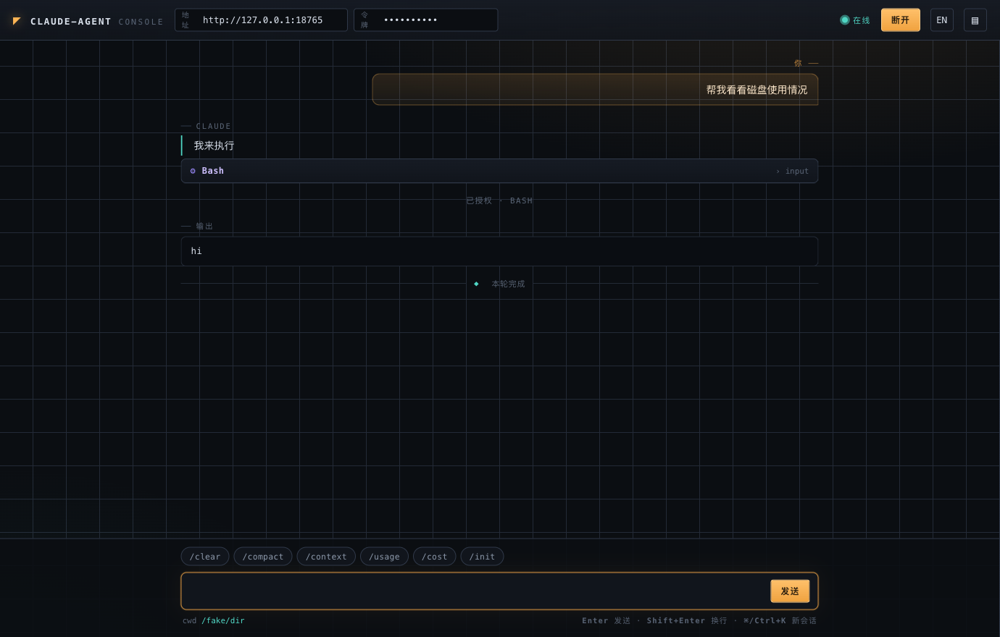
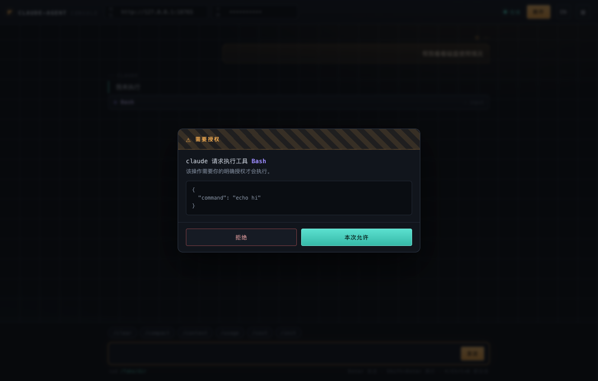
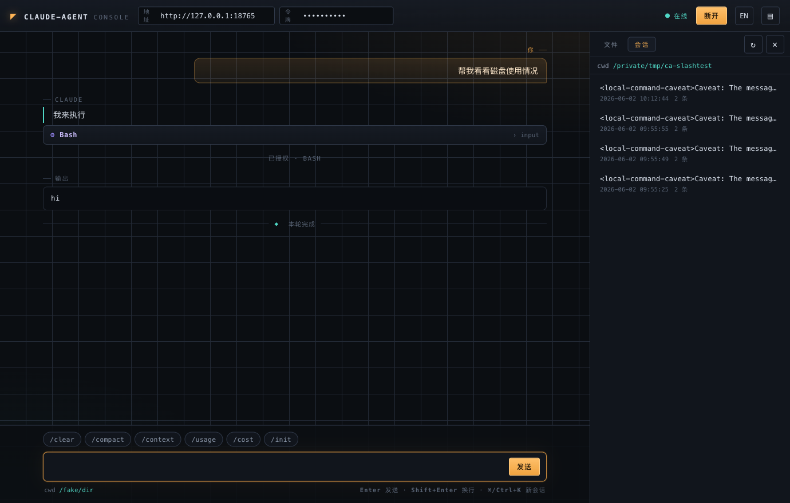

# claude-agent

**简体中文** · [English](./README.en.md)

> 一个单文件、零依赖的小代理：让你在浏览器里远程驱动**目标机**上的 [Claude Code](https://docs.anthropic.com/en/docs/claude-code) —— 基于 WebSocket，且**每一个危险操作都由你在浏览器里点头才执行**。

`claude-agent` 跑在目标服务器上，以子进程方式拉起本机已安装的 `claude` CLI（说它的
`stream-json` 双向控制协议），对外暴露一个带共享 token 鉴权的 WebSocket 端点。它把一个
**零依赖 Web 控制台**直接编进了二进制，所以浏览器一指就能用。

```
  浏览器 ──WS──> claude-agent（目标机）──子进程──> claude code CLI
   Web 控制台       token 鉴权                       在这台机器上干活
```

代理本身**不持有任何 API Key**。凭证、模型选择、第三方中转配置全部归目标机上的 `claude`
CLI 自己管 —— 代理只负责驱动它。


<p align="center"><em>内置控制台 —— 对话、原生命令栏、工具卡片，以及人在回路的授权确认。</em></p>

---

## 为什么需要它

有时候需要 Claude Code 干活的机器，并不是你面前这台：生产服务器、构建机、堡垒机后面的
VM。`claude-agent` 给那台机器一个轻量、可审计的远程操控面：

- **单个静态二进制**，零运行时依赖 —— 丢上去就能跑。
- **内置 Web 控制台** —— 不用单独构建或托管前端。
- **权限确认弹回你的浏览器。** 代理以 `--permission-mode default` 运行 `claude`，所以每个
  特权工具调用（Bash、写文件……）都会作为 `permission_request` 转发给你，**点了允许才执行**。
- **带围栏的文件管理** —— 在工作目录内浏览 / 查看 / 下载 / 上传，严格路径围栏（`..` 越界、
  软链逃逸都拦死）。
- **可嵌入** —— 同一个 WebSocket 端点也能藏在你自己的鉴权中继后端之后，不必直接暴露代理。
- **每用户独立凭据** —— 中继后端可在 WebSocket 升级请求里注入 `X-Claude-Auth-Token` /
  `X-Claude-Base-Url` / `X-Claude-Model` 请求头，agent 为该连接的 `claude` 子进程生成临时
  `--settings` 文件（0600，连接关闭即删），覆盖认证 token 与端点；用户未配置则沿用宿主共享凭据。

---

## 快速开始

### 1. 前置条件

在**目标机**上：

- `claude` CLI 已安装，且**用运行代理的同一个用户手动执行 `claude` 能正常对话**（即 `claude`
  已经能认证、能聊天）。代理沿用该用户 `claude` 已有的全部凭证/配置。
- Go 1.25+（仅从源码构建时需要）。

### 2. 构建并运行

```bash
git clone https://github.com/Mrliuch/claude-agent.git
cd claude-agent
go build -o claude-agent .

# 生成一个足够长的随机共享 token
AGENT_TOKEN=$(openssl rand -hex 24) ./claude-agent
```

然后浏览器打开 `http://<host>:8765/`，粘贴同一个 token，点 **CONNECT/连接**。

> Web 控制台从同源的 `/` 提供，没有 CORS 障碍。你在浏览器里粘贴的 token **不会**被写进下发的
> HTML。

---

## 配置

全部通过环境变量配置。

| 变量 | 说明 | 默认 |
|------|------|------|
| `AGENT_TOKEN` | **必填。** 共享鉴权 token，客户端需携带。 | — |
| `AGENT_LISTEN_ADDR` | 监听地址。 | `:8765` |
| `AGENT_UI` | 设为 `off` 关闭 `/` 上的内置 Web 控制台。 | `on` |
| `CLAUDE_BIN` | Claude Code CLI 的路径/命令。 | `claude` |
| `CLAUDE_MODEL` | 传给 `claude` 的模型；留空用 CLI 默认。 | _(空)_ |
| `CLAUDE_WORK_DIR` | `claude` 的工作目录（也是文件管理围栏根）。留空回退到运行用户的 `$HOME`。 | _(空)_ |
| `CLAUDE_PERMISSION_MODE` | 传给 `claude --permission-mode`。保持 `default` 才会弹窗确认危险操作。 | `default` |
| `CLAUDE_IDLE_TIMEOUT` | 空闲多少秒后回收会话（及 `claude` 子进程）。`0` = 禁用。 | `1800` |
| `AGENT_DEBUG` | 设为任意值则打印原始桥接流量日志。 | _(空)_ |
| `CLAUDE_DISABLE_BACKGROUND_TASKS` | 设为 `on` 则注入 `CLAUDE_CODE_DISABLE_BACKGROUND_TASKS=1`，禁用 Bash `run_in_background`。推荐在中继模式（代理后端）下开启：后台任务输出文件留在目标机，连接断开即杀进程，完成通知不可靠。 | `off` |
| `AGENT_WECHAT` | 设为 `on` 启用[微信 ClawBot 接入](#微信-clawbot-接入多账号)。 | `off` |
| `AGENT_WECHAT_TOKEN_PATH` | 微信账号 token 存放目录。 | `~/.config/claude-agent/wechat/` |
| `AGENT_WECHAT_BASEURL` | iLink 接入域名（一般无需改，便于测试 mock）。 | `https://ilinkai.weixin.qq.com` |
| `AGENT_WECHAT_MAX_SESSIONS` | 单账号并发会话上限（每会话 = 1 个 `claude` 子进程）。 | `20` |

> ⚠️ 在你在意的机器上，**绝不要**把 `CLAUDE_PERMISSION_MODE` 设成任何会绕过弹窗的值。整个设计
> 的意义就是 *你* 来批准每一步。

> 🔒 **Web 控制台已加认证。** 访问 `/` 需先输入 `AGENT_TOKEN`（与 WebSocket 复用同一 token）；
> 认证后种下 cookie，未认证只下发登录页。`AGENT_UI=off` 可整体关闭页面。

---

## 微信 ClawBot 接入（多账号）

> 🧪 **可选、默认关闭。** 不设 `AGENT_WECHAT=on` 时，本节一切逻辑都不会启动，对原有
> WebSocket / Web 控制台功能零影响。

[微信 ClawBot](https://www.ithome.com/0/931/431.htm) 是腾讯 2026-03 上线的官方插件，让你在微信聊天里
直接驱动本地 AI Agent。本通道实现了它的 **iLink 本地协议**，把 claude-agent 伪装成 ClawBot 端，
于是你可以**在微信里直接和目标机上的 `claude` 对话**，并支持**多个微信号各自作为独立机器人**。

```
微信用户 ──> ilinkai.weixin.qq.com ──长轮询──> claude-agent ──> claude CLI
                              多账号 / 每用户独立会话 / typing 保活 / 白名单授权
```

### 启用与登录

```bash
AGENT_TOKEN=<你的token> AGENT_WECHAT=on ./claude-agent
```

在 Web 控制台里管理账号(推荐):浏览器打开 `/` → 输入 `AGENT_TOKEN` 登录 → 点头部 **📱** 打开
「微信账号」面板 → **＋ 添加账号** → 弹出二维码 → 用微信「扫一扫」登录。二维码**过期自动刷新**，
页面轮询到「在线」自动收起。每个账号 token 持久化到 `AGENT_WECHAT_TOKEN_PATH` 目录，**重启自动恢复
登录、免重扫**;每个账号可独立移除。

> 单账号场景下,启动时二维码内容也会打印到日志(`journalctl`),但多账号建议走页面。

### 用法与边界

- **多账号**:每个微信号一套独立 `bot_token`，互不干扰;同一机器人下不同微信用户各自独立 `claude` 会话。
- **纯文字**:对齐 ClawBot 现状，仅收发文本(图片/语音/文件暂不支持)。
- **会话回收**:空闲按 `CLAUDE_IDLE_TIMEOUT` 回收 `claude` 子进程。
- **人在回路 + 白名单**:只读巡检命令(`ls`/`df`/`docker ps`/`git log`/`systemctl status` 等)自动放行;
  写/危险操作(`rm`/写重定向/`systemctl restart`/`docker run` 等)才把确认卡片发到微信,
  回复 `y`/`允许` 放行、`n`/`拒绝` 拒绝;`AskUserQuestion` 回复选项编号。
- **送达可靠性**:出站消息带唯一 `client_id` + `base_info`，并在处理期间 `sendtyping` 保活，
  避免回复落在窗口外被静默丢弃。

### ⚠️ 风险须知

- **iLink 是社区逆向得到的非官方契约**(腾讯只对官方 OpenClaw 开放)。腾讯改协议可能随时失效;
  存在 **ToS / 封号灰度风险**，请自行评估后在非主力微信号上使用。

---

## 部署

### 方式一：直接跑二进制（推荐）

直接在宿主机上跑，`claude` 才能看到**真实的宿主机文件系统** —— 排查这台机器的问题最合适。

`/etc/systemd/system/claude-agent.service`：

```ini
[Unit]
Description=claude-agent
After=network.target

[Service]
User=ops
Environment=AGENT_TOKEN=<你的随机token>
Environment=AGENT_LISTEN_ADDR=:8765
Environment=CLAUDE_WORK_DIR=/home/ops
ExecStart=/usr/local/bin/claude-agent
Restart=always

[Install]
WantedBy=multi-user.target
```

```bash
sudo systemctl daemon-reload && sudo systemctl enable --now claude-agent
```

### 方式二：Docker

仓库自带的 `Dockerfile` 会构建代理并内置 Node + Claude Code CLI。

```bash
docker build -t claude-agent .
docker run -d --name claude-agent -p 8765:8765 \
  -e AGENT_TOKEN=<你的随机token> \
  claude-agent
```

> ⚠️ 容器内的 `claude` 只能看到**容器内部**的文件系统。要排查宿主机，请用方式一，或挂载宿主机
> 目录 / 用 `--network host` 并按需提权。

---

## 安全模型

`claude-agent` 让浏览器拥有在一台机器上执行命令的能力。请把 token 当成生产凭证，并把暴露面收紧：

- **用防火墙限制端口。** 只放通应该能访问它的网络/主机。
- **token 走 query 参数**（WebSocket 不便带自定义 header）。超出可信内网/VPN 范围请在前面套
  TLS —— 用反向代理终结 `wss://`，或经 SSH/VPN 隧道访问。
- **批准是设计上强制的。** `--permission-mode default` 下，没有你的允许，任何特权工具都不会跑。
  拒绝永远是一键（或按 `Esc`）。
- **文件管理被围栏在** `CLAUDE_WORK_DIR`：词法上中和 `..`，软链解析后再校验是否仍在围栏根内，
  之后才允许读写。
- **关掉控制台** 用 `AGENT_UI=off`，适合只想从自己的后端中继驱动代理的场景。

---

## Web 控制台

从 `/` 提供（除非 `AGENT_UI=off`）。它是一个编进二进制的零依赖单文件 HTML —— 无构建步骤、无
外部字体或 CDN、可离线运行。

- **对话** 远程 Claude：流式助手文本、工具调用卡片、工具输出。
- **原生命令栏** —— 一键把 `/clear`、`/compact`、`/context`、`/usage`、`/cost`、`/init`
  直接发给 Claude（走同一条 `stream-json` 通道）。
- **授权弹窗** 对每个 `permission_request` —— 允许/拒绝前先看清确切的工具 + 入参。
- **文件抽屉** —— 浏览工作目录、查看文本文件、下载，全程围栏。
- **历史会话** —— 查看当前目录的过往 Claude 会话、回看任意会话内容，并可**一键续接**
  恢复上下文继续聊（`--resume`）。
- **会话续接** —— 控制台记住 `session_id` 并以 `--resume` 重连；`⌘/Ctrl+K` 开启新会话。
- **中英双语** —— 右上角一键切换界面语言（记忆选择）。

每个危险操作都会停下来等你授权：



浏览并续接当前工作目录的 Claude 历史会话：



---

## 藏在你自己的后端之后（中继模式）

这个 WebSocket 端点与传输无关：任何后端都可以用自己喜欢的方式鉴权自己的用户，然后**透明地把帧
中继**给 `claude-agent`。代理始终是一个只认 token 的"哑"执行器，你的后端永远不需要 API Key。
设 `AGENT_UI=off`，代理就退化成纯协议端点。

---

## 协议参考

WebSocket：`GET /agent/chat?token=<AGENT_TOKEN>[&session_id=<id>]`
健康检查：`GET /healthz` → `{"status":"ok"}`

**客户端 → 服务端**

```jsonc
{ "type": "user_message", "text": "看看磁盘占用" }
{ "type": "user_message", "text": "/context" }   // 原生斜杠命令同样可用
{ "type": "permission_response", "request_id": "...", "allow": true, "tool_input": { } }
{ "type": "close" }
```

> Claude 原生斜杠命令（`/clear`、`/compact`、`/context`、`/usage`、`/cost`、`/init` 等）
> 本质上就是「文本以 `/` 开头的用户消息」—— Claude 会在同一条 `stream-json` 通道里解释它们，
> 所以控制台的命令栏只是把它们发出去而已。

**服务端 → 客户端**

| `type` | 含义 |
|--------|------|
| `ready` | 会话就绪。携带 `cwd`、`session_id`。 |
| `assistant` | `blocks[]`，元素为 `{kind:"text"}` / `{kind:"tool_use", name, input}`。 |
| `tool_result` | `results[]`，元素为 `{content, is_error}`。 |
| `permission_request` | `request_id`、`tool_name`、`tool_input`、`title`、`description`。 |
| `result` | 本轮汇总：`subtype`、`is_error`、`duration_ms`、`total_cost_usd`、`result`。 |
| `error` | `{msg}`。 |
| `closed` | `claude` 退出；含 `stderr` 尾部。 |

### 文件管理 HTTP API

全部需要 `?token=<AGENT_TOKEN>`；所有路径相对并围栏于 `CLAUDE_WORK_DIR`。响应统一用信封
`{code, msg, data}`（`code:0` = 成功）。

| 方法与路径 | 用途 |
|-----------|------|
| `GET  /agent/fs/list?path=` | 列目录。 |
| `GET  /agent/fs/read?path=` | 读文本文件（≤1 MB，超出截断）。 |
| `GET  /agent/fs/tree` | 递归相对路径（跳过 `.git`、`node_modules` 等）。 |
| `GET  /agent/fs/download?path=` | 流式下载任意文件。 |
| `POST /agent/fs/write` | `{path, content}`。 |
| `POST /agent/fs/upload` | `{path, content_b64}`（≤50 MB）。 |
| `POST /agent/fs/mkdir` | `{path}`。 |
| `DELETE /agent/fs/delete?path=` | 删除（不能删围栏根本身）。 |

### 历史会话 HTTP API

只读访问**当前工作目录**的 Claude 会话历史（CLI 存放在
`~/.claude/projects/<slug>/<id>.jsonl`）。需 token；同样使用 `{code, msg, data}` 信封。

| 方法与路径 | 用途 |
|-----------|------|
| `GET /agent/sessions/list` | 列出当前目录的会话（`id`、`title`、`messages`、`mtime`、`size`）及其 `cwd`。 |
| `GET /agent/sessions/read?id=<uuid>` | 把一个会话解析成只读回看记录（`items[]`，元素为 `{role, blocks, ts}`）。 |

要**续接**某个会话，只需用 `&session_id=<id>` 打开对话 WebSocket —— Claude 会以 `--resume`
重新挂接并恢复此前上下文。

---

## 开发

```bash
go vet ./...
go test ./...     # 含针对假 claude 的端到端测试（零 API 成本）
go build -o claude-agent .
```

测试套件用 `cmd/fakeclaude` —— 一个会说 `stream-json` 控制协议的桩，因此完整的 桥接 +
WebSocket + 权限往返链路都被覆盖，且不调用真实 Claude API。`cmd/smoke` 是用来验证线上部署的
一次性客户端：

```bash
go build -o smoke ./cmd/smoke
./smoke ws://<host>:8765/agent/chat <AGENT_TOKEN> "只回复：你好"
```

### 项目结构

```
main.go        入口
config.go      环境变量配置
server.go      HTTP/WebSocket 路由、心跳、空闲回收
bridge.go      驱动 claude CLI 子进程（stream-json）
protocol.go    把 claude 消息翻译成前端友好的事件
fs.go          带路径围栏的文件管理端点
sessions.go    只读的 Claude 会话历史（列表 + 回看）
web.go         嵌入并托管控制台
web/index.html 零依赖 Web 控制台
internal/wechat 微信 ClawBot 接入通道（iLink 协议、可选）
cmd/fakeclaude 测试用的假 claude
cmd/smoke      一次性部署烟雾测试客户端
```

---

## 许可证

[MIT](./LICENSE)

> 本项目驱动 Claude Code CLI，但与 Anthropic 无关联、未获其背书。"Claude" 与 "Claude Code"
> 是 Anthropic 的商标。
